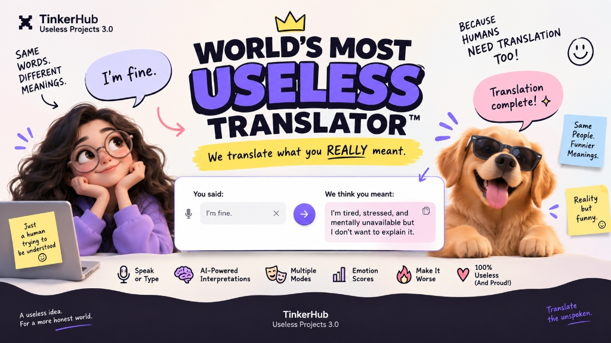
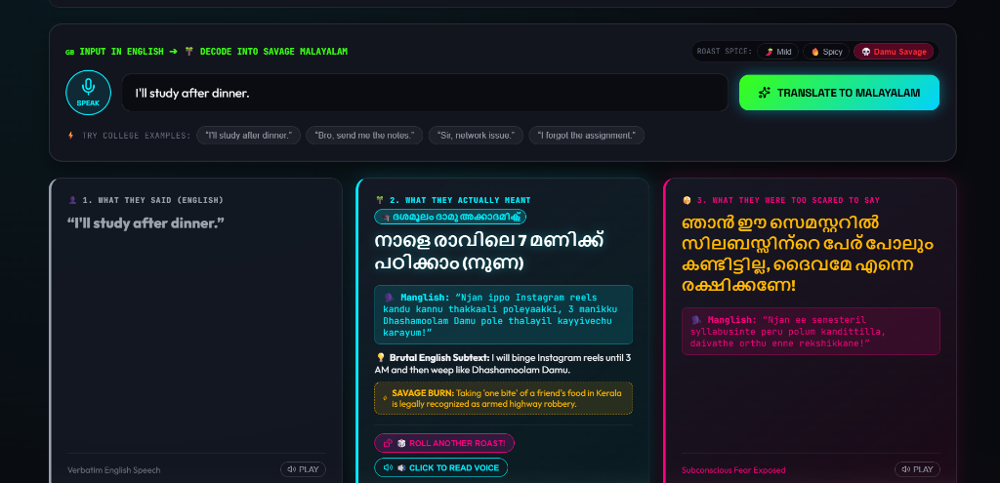
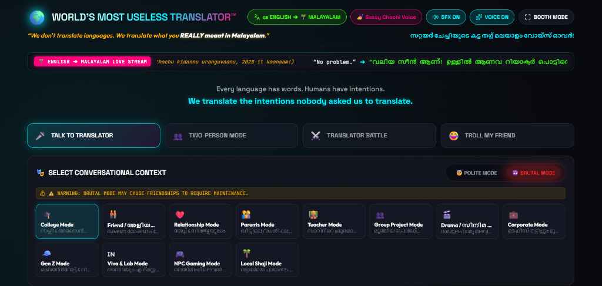
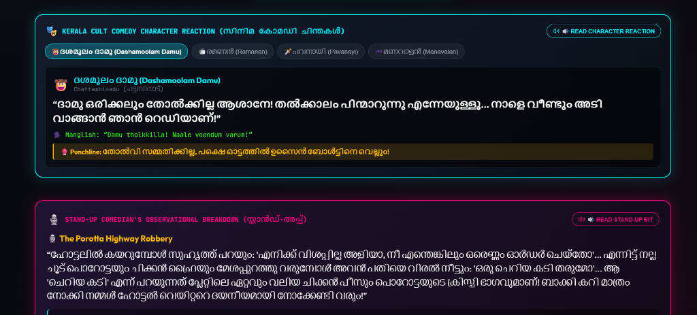
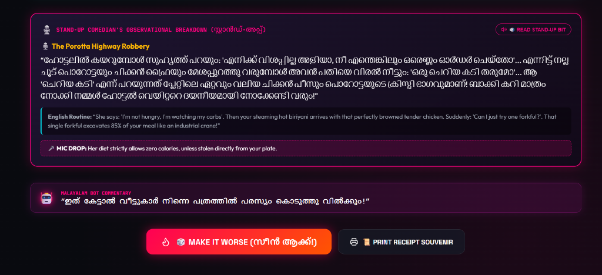
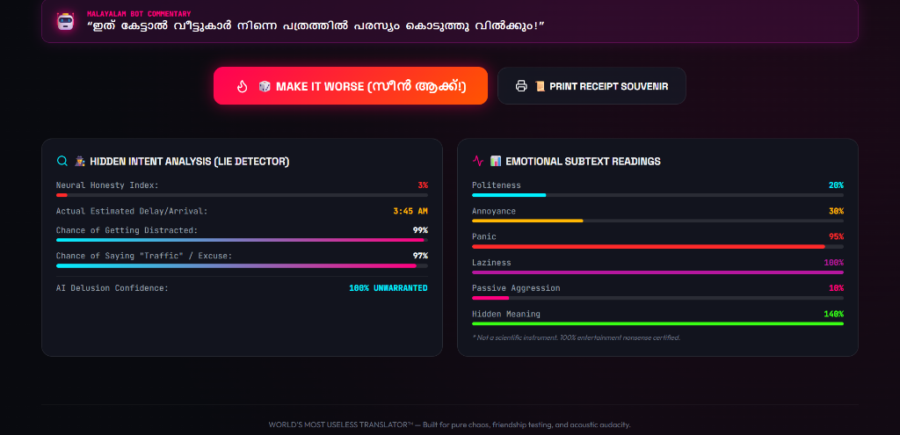

# World's Most Useless Translator 🎯

An AI-powered comedy translator that reveals what people *really* mean behind everyday polite conversations, infused with Malayalam cult comedy punchlines, brutal reality checks, and a chaotic "Make It Worse" amplifier.

## Basic Details
### Team Name: 404 Brain Not Found

### Team Members
- Team Lead: Arbeon George Brown - St. Thomas Institute for Science and Technology

### Hosted Project Link
- **Live Demo**: [https://arv6708.github.io/worlds-most-useless-translator/](https://arv6708.github.io/worlds-most-useless-translator/)

### Project Description
An unapologetically useless translator that takes innocent everyday statements—like *"I'll be there in 5 minutes"*, *"Let's catch up soon"*, or *"Can you do me a small favor?"*—and translates them into the unfiltered, brutally honest thoughts people are actually thinking, voiced through legendary Malayalam cinema comedy archetypes (Dashamoolam Damu, Ramanan, Manavalan, Salim Kumar, and Pavanayi).

### The Problem (that doesn't exist)
In modern society, humans waste thousands of hours decoding passive-aggressive politeness, fake corporate enthusiasm, and casual Kerala tardiness. Nobody has the courage to say *"I am still in my lungi watching reels"*, so they say *"I'm stuck in traffic"*. The world apparently needed an algorithm to strip away fake smiles and replace them with raw existential chaos.

### The Solution (that nobody asked for)
We built an interactive, multi-mode comedy engine that:
1. **Subtext & Thought Translation**: Exposes the brutal internal monologue behind every sentence.
2. **Malayalam Cult Comedy Dialogue Generator**: Automatically pairs every response with iconic dialogue references (from CID Moosa, Punjabi House, Kalyanaraman, etc.).
3. **Stand-Up Routine Monologue**: Generates relatable stand-up comedian observational commentary.
4. **"Make It Worse" Escalation Mode**: Progressively escalates a polite reply into an irreversible social catastrophe.
5. **Multiplayer Roast Modes**: Two-person conversational roast and friend-troll generator.
6. **Real-Time Speech & Soundboard**: Speaks the punchline out loud with authentic retro sound effects.

## Technical Details
### Technologies/Components Used
For Software:
- **Languages used**: JavaScript (ES6+), HTML5, CSS3
- **Frameworks used**: React 19, Vite
- **Libraries used**: Lucide React, Canvas Confetti
- **Audio & Speech**: Web Speech Synthesis API, Web Audio API Sound Synthesizer
- **Deployment & CI/CD**: GitHub Actions, GitHub Pages / Vercel

### Implementation
For Software:

# Installation
```bash
git clone https://github.com/arv6708/worlds-most-useless-translator.git
cd worlds-most-useless-translator
npm install
```

# Run
```bash
npm run dev
```

# Build
```bash
npm run build
```

### Project Documentation
For Software:

# Screenshots


*Solo Translator Interface: Unfiltered 3-tier translation with savage Malayalam subtext & burns*


*Context and Mode Selection: 12 comedic context modes (College, Viva, Corporate, Shaji Mode, etc.) with Brutal Mode toggle*


*Kerala Cult Comedy Character Reaction: Legendary movie dialogues & punchlines featuring Dashamoolam Damu, Ramanan, Pavanayi, and Manavalan*


*Stand-Up Comedy Breakdown: Observational Malayali routine, mic-drop punchlines, and live AI bot roasts*


*Lie Detector & Subtext Readings: Real-time neural honesty index, arrival delay estimates, and emotional subtext meters*

---
Made with ☕ and pure chaos for TinkerHub Useless Projects 3.0.
